## 项目图示（Mermaid）

下面包含三张图：E-R 图、用例图和类图。可在支持 mermaid 的渲染器中查看（例如 VS Code 的 Markdown Preview，或 GitHub 的 mermaid 支持）。

### Agent 架构图（总览）

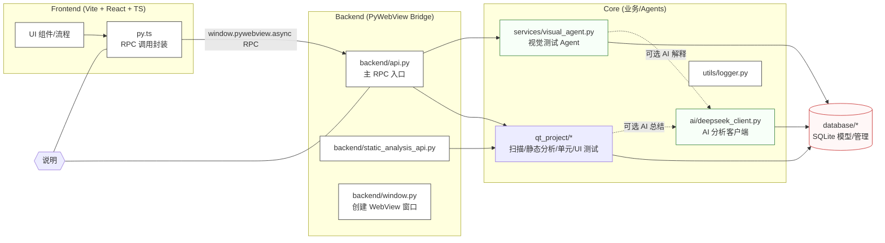

**数据流简述**
- 前端 `py.ts` 通过 `window.pywebview` 以异步 RPC 调用后端 `backend/api.py` 或专项 API（如静态分析）。
- 后端 Bridge 仅做参数校验与转发，真正逻辑在 `core/`：
  - `qt_project/*` 负责项目扫描、静态分析（`cppcheck_manager.py`）、测试执行（`unit_test_runner.py`、`ui_test_runner.py`）。
  - `services/visual_agent.py` 管理视觉测试步骤、截图采集与结果记录。
  - `ai/deepseek_client.py` 为可选 AI 解释/总结模块。
- 结果统一入库到 `database/*`，前端再拉取展示与回放。

**架构约束**
- 仅传递 JSON 可序列化数据（不传函数/类实例）。
- 前端所有 Python 调用必须 `await`，避免阻塞 UI。
- 前后端端口需一致：见 `backend/config.py` 与 `frontend/vite.config.ts`。

**E-R 图（Mermaid • Chen 风格）**

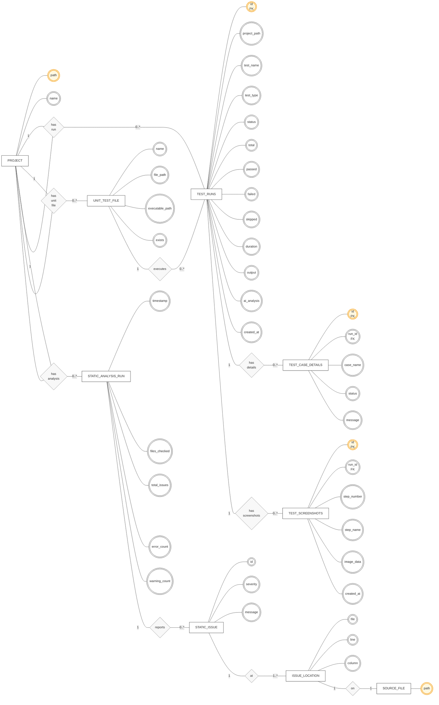

**构件图（可复用组件）**

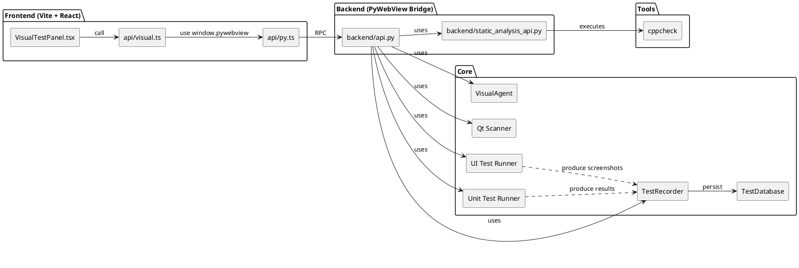

**用例图（PlantUML）**

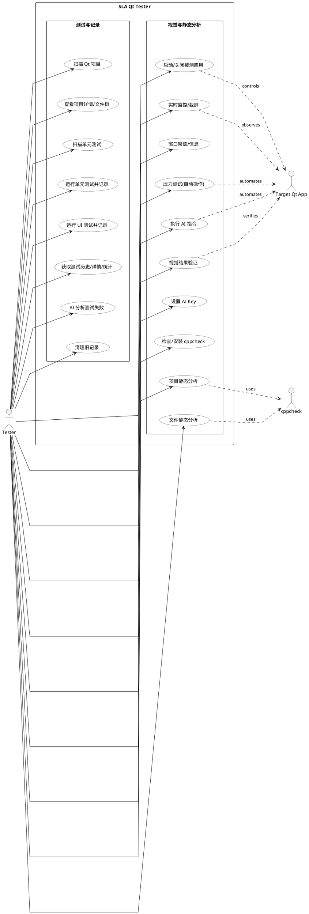

**类图（重要类与关系，简化）**

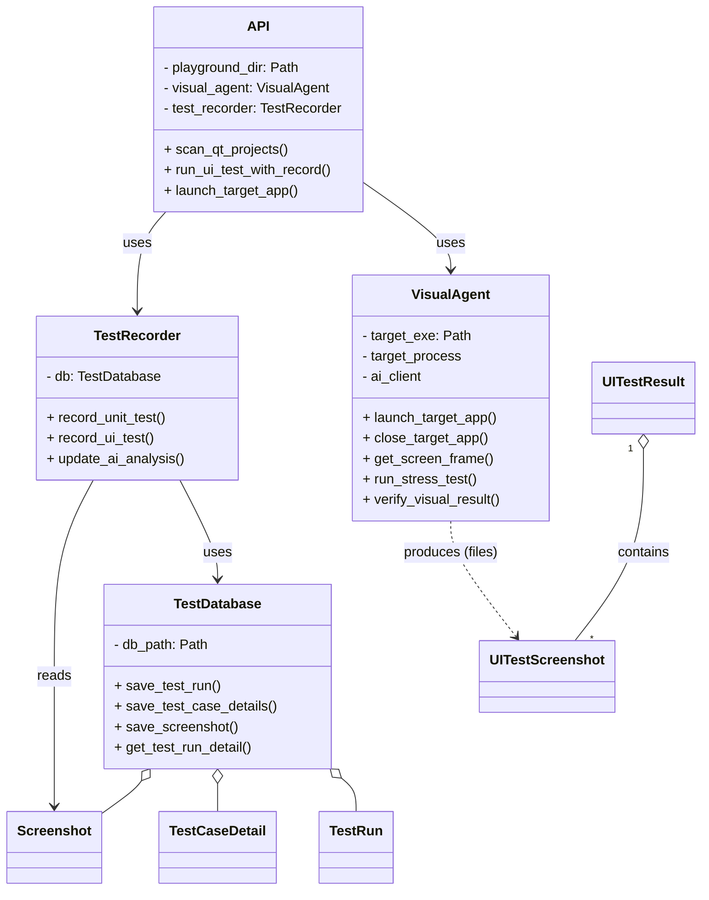

---

简要说明：
- ER 图基于 `core/database/db_manager.py` 中的三张表结构。
- 用例图反映前端（用户）→ API → VisualAgent / TestRecorder / TestDatabase 的交互链路。
- 类图为简化视图，展示主要类与依赖关系（`API`、`VisualAgent`、`TestRecorder`、`TestDatabase`、数据模型）。

渲染提示：在 VS Code 中打开此文件并使用 Markdown Preview（确保安装 mermaid 支持扩展，或使用 `Markdown Preview Enhanced`）。

## 数据库设计

**概览**

- 目标：持久化测试运行历史、用例级别明细与 UI 截图，支持历史检索、统计、以及后续 AI 分析。
- 存储：SQLite（项目根目录 `test_history.db`）。实现见 [core/database/db_manager.py](core/database/db_manager.py)，数据模型见 [core/database/models.py](core/database/models.py)。
- 表与关系：
  - `test_runs`：测试运行主表（一条记录代表一次单元/UI 测试执行）。
  - `test_case_details`：用例明细（从属 `test_runs`；1:N）。
  - `test_screenshots`：截图（从属 `test_runs`；1:N）。

**表结构要点**

- `test_runs`
  - 关键字段：`project_path`、`test_name`、`test_type('unit'|'ui')`、`status('passed'|'failed'|'error')`、`total/passed/failed/skipped`、`duration`、`output`、`ai_analysis`、`created_at`。
  - 用途：作为一次测试会话的聚合根，关联明细与截图，承载整体状态与控制台输出、AI 分析结论。
- `test_case_details`
  - 关键字段：`run_id(FK)`、`case_name`、`status('PASS'|'FAIL'|'SKIP')`、`message`。
  - 用途：反映用例级断言结果与失败信息，便于定位问题。
- `test_screenshots`
  - 关键字段：`run_id(FK)`、`step_number`、`step_name`、`image_data(BLOB)`、`created_at`。
  - 用途：保存 UI 步骤截图；前端读取时可转 base64 传输展示。

**关系与索引**

- 关系：`test_runs (1) —> (N) test_case_details`；`test_runs (1) —> (N) test_screenshots`。
- 外键：DDL 中声明 `FOREIGN KEY (run_id) REFERENCES test_runs(id) ON DELETE CASCADE`（建议在连接后启用 `PRAGMA foreign_keys=ON` 以确保约束生效）。
- 索引：
  - `test_runs(project_path)`：加速按项目路径筛选历史。
  - `test_runs(created_at DESC)`：加速时间倒序读取最新记录。
  - `test_screenshots(run_id)`：加速按运行批次读取截图。

**数据流（写入与读取）**

- 写入：
  - 单元测试：由 `UnitTestRunner` 解析 QTest 输出，`TestRecorder.record_unit_test()` 写入 `test_runs` 与 `test_case_details`。
  - UI 测试：由 `UITestRunner` 产出截图，`TestRecorder.record_ui_test()` 写入 `test_runs` 与 `test_screenshots`。
  - AI 分析：`TestRecorder.update_ai_analysis()` 或后续流程更新 `test_runs.ai_analysis`。
- 读取：
  - 列表：`TestDatabase.get_test_runs(project_path, limit)` 按项目与时间倒序分页。
  - 详情：`TestDatabase.get_test_run_detail(run_id)` 聚合主记录、用例明细与截图。
  - 统计：`TestDatabase.get_statistics(project_path)` 计算汇总指标。

**改进建议**

- 开启外键约束：在每次 `sqlite3.connect()` 后执行 `PRAGMA foreign_keys=ON`，确保级联删除与引用完整性。
- 存储策略：当截图体量较大时，可改为存储文件路径+元数据（避免数据库膨胀与备份压力），并提供清理策略。
- 复合索引：根据查询热点考虑 `(project_path, created_at)` 复合索引；对 `test_name` 辅助检索也可加索引。
- 写入性能：启用 WAL 模式（`PRAGMA journal_mode=WAL`）提升并发读写体验。
- 时间语义：统一时区（UTC）并在前端展示时本地化；`duration` 可改为数值（毫秒）便于统计。

**数据库 ER 图（PlantUML）**

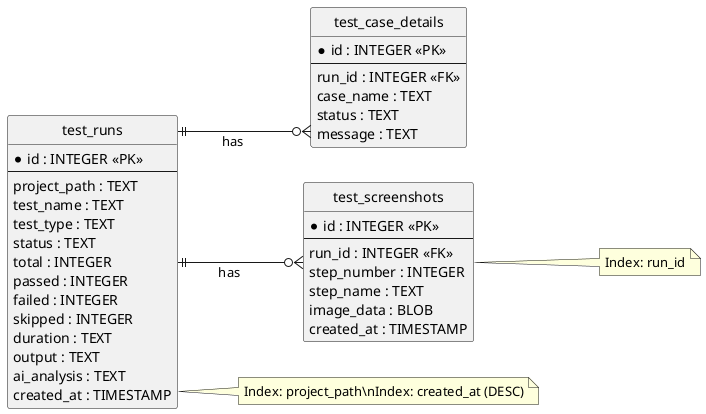

**数据库数据流图（DFD）**

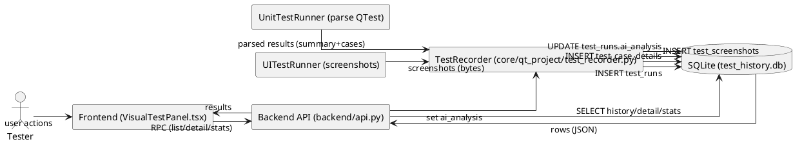

**数据库数据流图（Mermaid）**

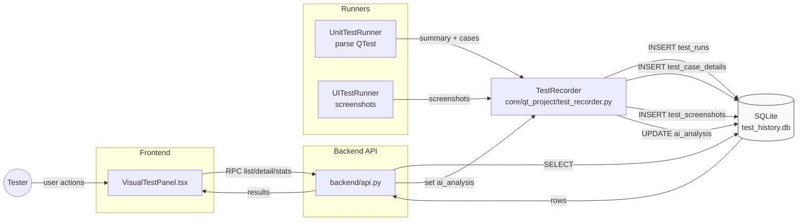

**写入数据流（Mermaid）**

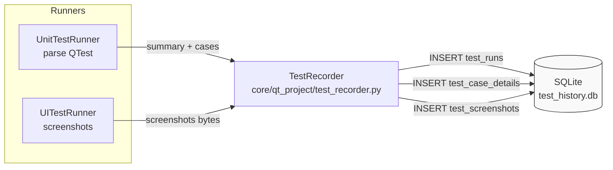

**查询数据流（Mermaid）**

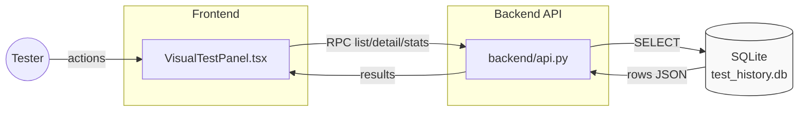

**更新数据流（Mermaid）**

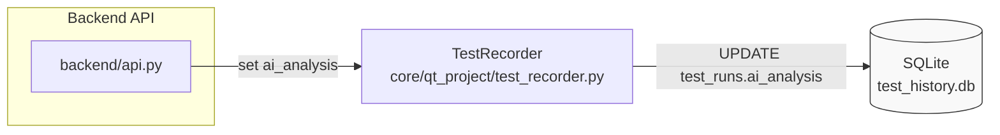

